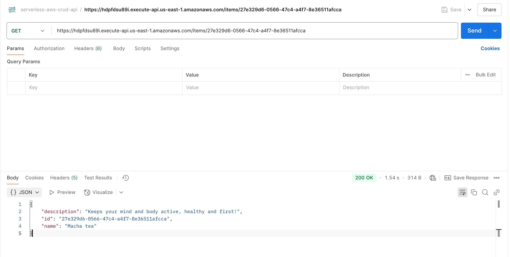

# Serverless CRUD API with AWS API Gateway, DynamoDB, and Python

This project implements a Serverless CRUD API using AWS API Gateway, DynamoDB, and Python with the Serverless Framework.

## Table of Contents
- [Project Overview](#project-overview)
- [Architecture](#architecture)
- [Prerequisites](#prerequisites)
- [Installation](#installation)
- [Configuration](#configuration)
- [Deployment](#deployment)
- [API Endpoints](#api-endpoints)
- [Testing Locally](#testing-locally)
- [Project Structure](#project-structure)
- [GitHub Actions CI/CD](#github-actions-cicd)
- [Troubleshooting](#troubleshooting)
- [License](#license)

## Project Overview
This project showcases a CRUD API built with the Serverless Framework, using:
- **AWS API Gateway** to expose HTTP endpoints.
- **AWS Lambda** to handle requests with Python functions.
- **DynamoDB** to store items.
- **Serverless Framework** to deploy the infrastructure as code.

## Architecture
1. API Gateway receives HTTP requests.
2. Routes are mapped to Lambda functions.
3. Lambda functions perform CRUD operations on DynamoDB.

## Prerequisites
- Node.js and npm
- Python 3.12+
- AWS Account
- Serverless Framework
- GitHub for CI/CD

## Installation
1. Clone the repository:
   ```bash
   git clone https://github.com/dcodevalley/serverless-aws-crud-api.git
   cd crud-api
   ```
2. Install dependencies:
   ```bash
   npm install
   python -m venv venv
   source venv/bin/activate
   pip install -r requirements.txt
   ```

## Configuration
1. Create a `.env` file or use GitHub Secrets for CI/CD:
   ```plaintext
   AWS_ACCESS_KEY_ID=your-access-key
   AWS_SECRET_ACCESS_KEY=your-secret-key
   SERVERLESS_ACCESS_KEY=your-serverless-access-key
   ```
2. Update the `serverless.yml` file to use your desired AWS region and DynamoDB table name.

## Deployment
1. Authenticate Serverless Framework:
   ```bash
   serverless login
   ```
2. Deploy to AWS:
   ```bash
   serverless deploy --stage dev
   ```

## API Endpoints
- `POST /items` - Create an item
- `GET /items` - Get all items
- `GET /items/{id}` - Get a specific item by ID
- `PUT /items/{id}` - Update an item by ID
- `DELETE /items/{id}` - Delete an item by ID

## Testing Locally
Use the `serverless-offline` plugin to test locally:
```bash
serverless offline
```
Access the API at: `http://localhost:3000`

## Project Structure
```
crud-api/
├── handler.py              # Lambda function handlers
├── serverless.yml          # Serverless configuration
├── requirements.txt        # Python dependencies
├── package.json            # Node.js dependencies
└── README.md               # Project documentation
```

## GitHub Actions CI/CD
- The project uses GitHub Actions to automatically deploy on pushes to the `main` branch.
- Ensure `AWS_ACCESS_KEY_ID`, `AWS_SECRET_ACCESS_KEY`, and `SERVERLESS_ACCESS_KEY` are stored as secrets in your GitHub repository.

## Troubleshooting
- Ensure the `serverless-offline` plugin is installed if running locally.
- Verify AWS credentials are correctly configured.
- Check `serverless.yml` for correct table names and resource permissions.

## Screenshots:





## License
This project is licensed under the MIT License.

---

Happy Coding! 🚀
